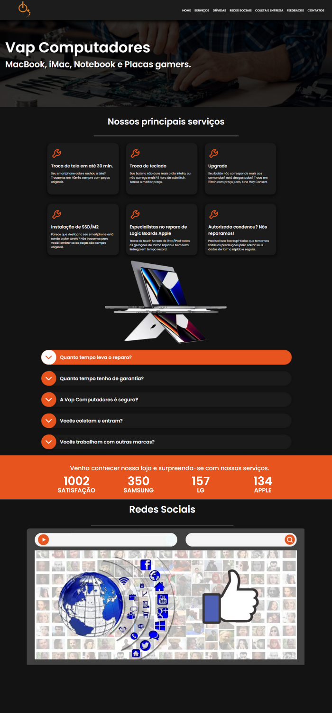

# Vap Computadores - LandingPage

<!---Esses são exemplos. Veja https://shields.io para outras pessoas ou para personalizar este conjunto de escudos. Você pode querer incluir dependências, status do projeto e
 informações de licença aqui--->

> Landing Page para assistência técnica de Computadores. 

### :rocket: Aplication link

Link: Em breve...

### 🔧 Ajustes e alterações

✔️ O projeto foi finalizado.

- [x] Corpo do site com HTML;
- [x] Estilização com CSS;
- [x] Componetização 'cardServices', 'buttonItem', 'dataItem' & 'feedbackClient';
- [x] Adicionar Carrossel; 
- [x] Adicionar Logo;
- [x] Responsividade;
- [ ] Adicionar informações do cliente; 

### 🎮 Como projeto trabalha

O projeto consiste numa Landing page para uma assistência técnica. 
O projeto foi desenvolvido com <i>NextJS</i>.

## 👨‍💻 Tecnologias
Tecnologias e libs utilizadas no projeto:
<ul>
    <li>HTML</li>
    <li>CSS</li>
    <li>JavaScript</li>
    <li>NextJS</li>
    <li>Undraw Illustrations</li>
    <li>LocalStorage</li>
    <li>React Hooks</li>
    <li>React-Icons</li>
    <li>Multi Carousel</li>
</ul>

## 🤝 Colaboradores

<table>
  <tr>
    <td align="center">
      <a href="#">
         
        
          <b>#</b>
        
      </a>
    </td>
    <td align="center">
      <a href="#"
         
        
          <b>#</b>
        
      </a>
    </td>
  </tr>
</table>

## :closed_book: Necessidades ##

Depois de iniciar :checkered_flag:, você precisa ter o  [Git](https://git-scm.com) e o [Node](https://nodejs.org/en/) instalados.

## :checkered_flag: Iniciar ##

